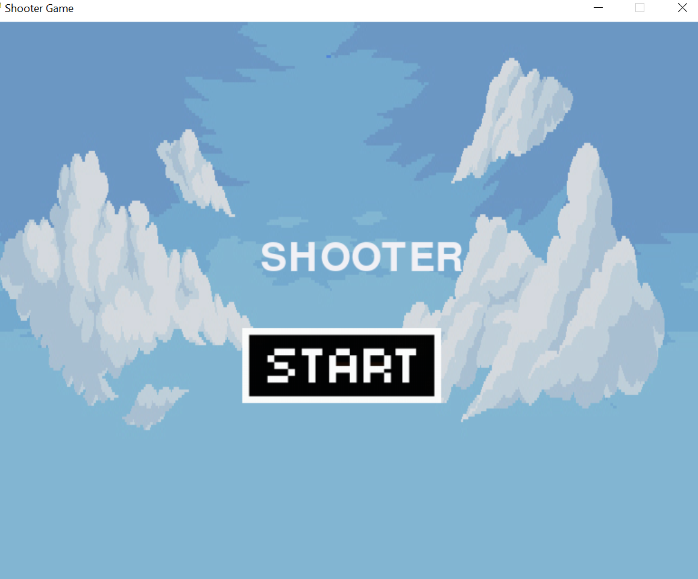
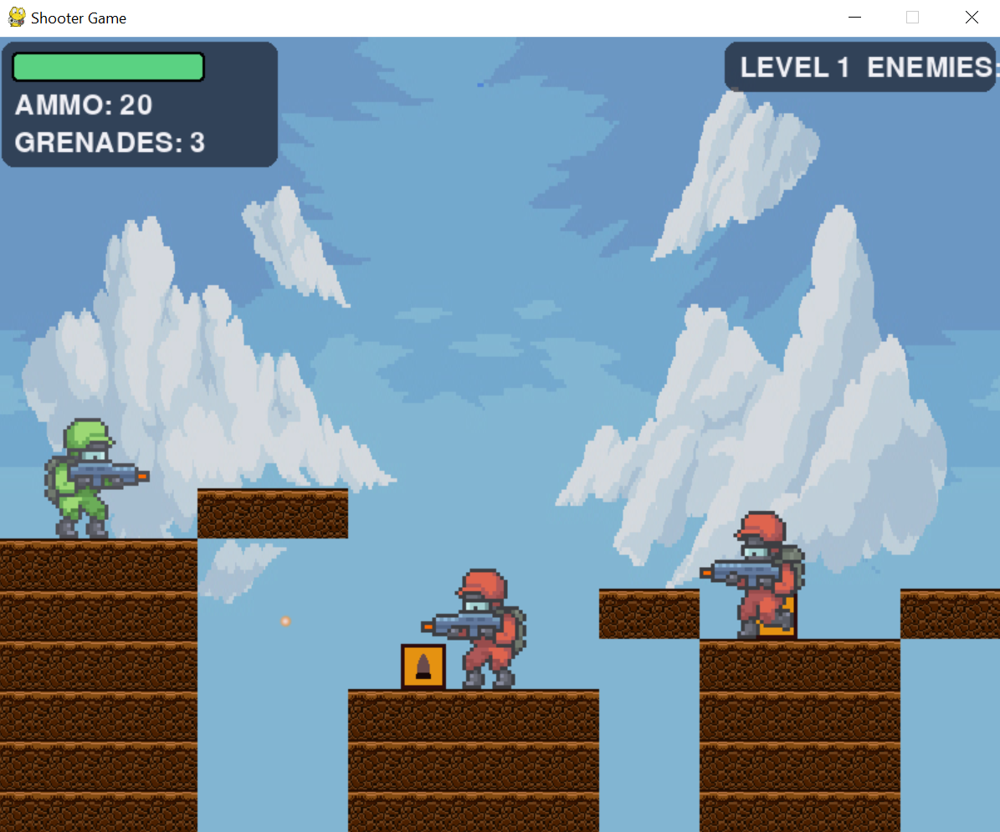
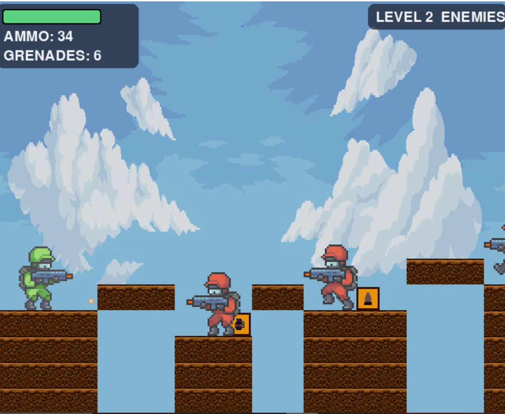

# Shooter Game

A 2D side-scrolling platformer shooter built with Pygame. Fight through
tile-based levels, dodge enemy fire, collect ammo/health/grenade pickups,
and reach the exit to advance.

## Requirements

- Python 3.8+
- Pygame

Install Pygame if you don't have it:

```
pip install pygame
```

## Running the game

```
python shooter_game.py
```

## Controls

| Key         | Action                     |
|-------------|-----------------------------|
| A           | Move left                  |
| D           | Move right                 |
| W           | Jump                       |
| SPACE       | Shoot                      |
| Q           | Throw grenade               |
| ESC         | Quit                       |
| Mouse click | Interact with menu buttons  |

## Gameplay

- Walk, jump, and shoot your way across each level's platforms and gaps.
- Enemies will chase and shoot at you if you get close.
- Pick up floating item boxes for health, ammo, or extra grenades.
- Reach the gold exit line at the end of a level to move on to the next one.
  Ammo and grenades carry over between levels; health resets to full.
- Falling into a pit or running out of health ends the run.
- Clear every level to win. Use the Restart / Exit buttons on the
  Game Over and Win screens to play again or quit.

## Asset folder structure

The game expects an `img/` folder next to the script, laid out like this:

```
img/
├── background/     any number of PNGs, used as backdrop layers
├── tile/           PNGs used for ground and platform tiles
├── player/
│   ├── Idle/       0.png, 1.png, ...
│   ├── Run/
│   ├── Jump/
│   └── Death/
├── enemy/
│   ├── Idle/
│   ├── Run/
│   ├── Jump/
│   └── Death/
├── explosion/       exp1.png ... exp5.png
├── icons/
│   ├── bullet.png
│   ├── grenade.png
│   ├── health_box.png
│   ├── ammo_box.png
│   └── grenade_box.png
├── start_btn.png
├── restart_btn.png
└── exit_btn.png
```


## Levels

Levels are defined as simple grids near the top of the script (`LEVELS`),
each describing the ground layout, floating platforms, enemy positions,
item spawns, and the player's starting point. Add a new dict to `LEVELS`
to add a new level.

## Known limitations

- Enemies don't jump nd they'll js walk into a pit if one's in their path.
- Bullets and grenades pass through tiles rather than colliding with them.
- Tile art uses a single tile image per level rather than distinct
  edge/corner variants.

  ## Some screenshots ig
  

  
  

